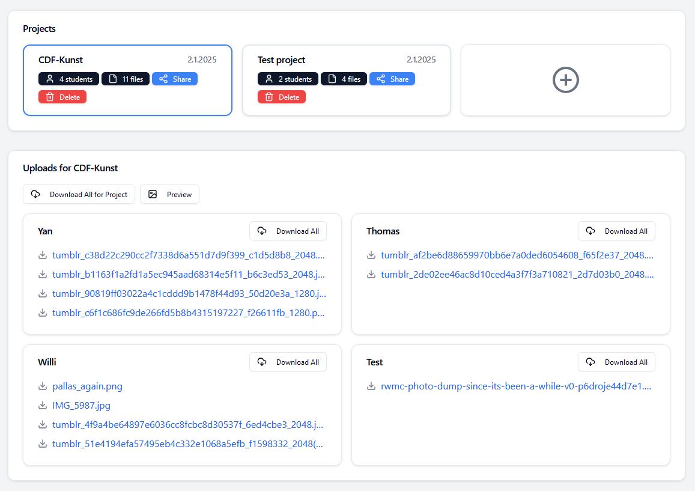

# Simple Upload Service

A simple project-based file upload service.
Designed to be used in a school context, where students can upload their files to a specific project.

## Screenshots




## Deploy

Requirements:

- Any web server with PHP (I use 7.4)
- A MySQL database (others may work fine, if not, adjustments can be made easily)

Code adjustments/configuration:

- In [useApi.ts](frontend/upload-service-frontend/src/hooks/useApi.ts), you can set the base URL (base-dir).
- In [db.php](backend/api/db.php), you can set the database connection parameters.
- In [adminauth.php](backend/api/adminauth.php), you can set the admin password (sha256 hashed).
- Create the tables as specified in [create-tables.sql](backend/setup/create-tables.sql)

Build the frontend:

```bash
cd frontend/upload-service-frontend
yarn install # you may also use npm, but I prefer yarn here
npm run build
```

This will be the directory structure on the server:

- base-dir
    - api
        - adminauth.php
        - index.php
        - db.php
    - uploads
    - index.html
    - static
        - ... frontend files
    - ... other frontend files

If you have any questions, feel free to ask.
